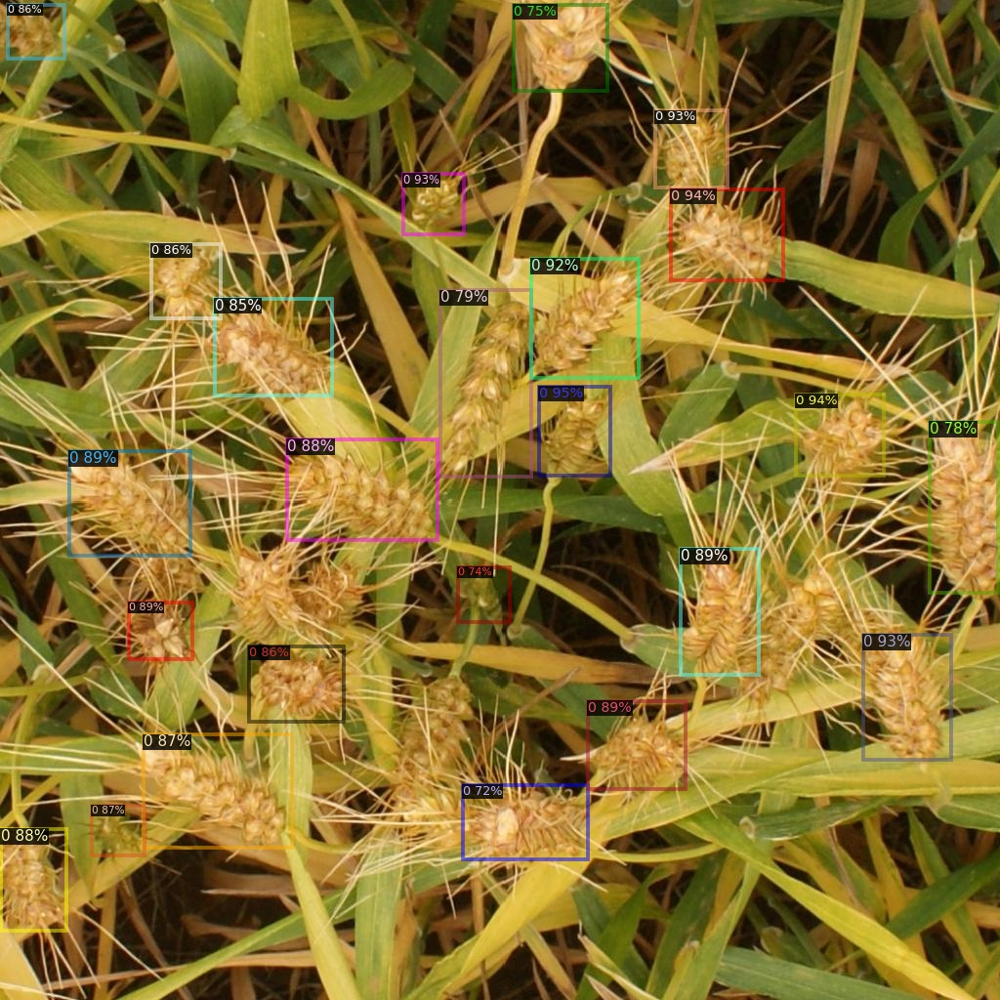
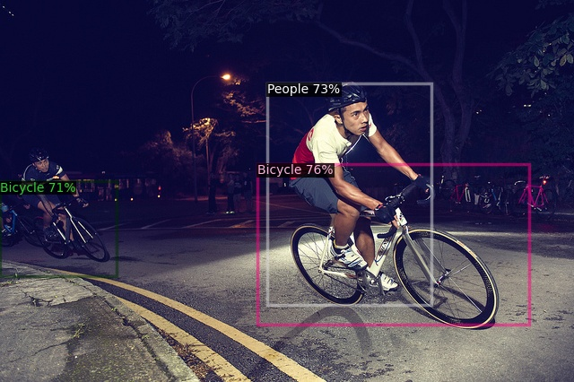

# Unbiased Teacher for Semi-Supervised Object Detection

 [](https://opensource.org/licenses/MIT)

**Unbiased Teacher for Semi-Supervised Object Detection**<br>
[Yen-Cheng Liu](https://ycliu93.github.io/), [Chih-Yao Ma](https://chihyaoma.github.io/), [Zijian He](https://research.fb.com/people/he-zijian/), [Chia-Wen Kuo](https://sites.google.com/view/chiawen-kuo/home), [Kan Chen](https://kanchen.info/), [Peizhao Zhang](https://scholar.google.com/citations?user=eqQQkM4AAAAJ&hl=en), [Bichen Wu](https://scholar.google.com/citations?user=K3QJPdMAAAAJ&hl=en), [Zsolt Kira](https://www.cc.gatech.edu/~zk15/), [Peter Vajda](https://sites.google.com/site/vajdap)<br>
International Conference on Learning Representations (ICLR), 2021 <br>

[[arXiv](https://arxiv.org/abs/2102.09480)] [[OpenReview](https://openreview.net/forum?id=MJIve1zgR_)] [[Project](https://ycliu93.github.io/projects/unbiasedteacher.html)]

<p align="center">

</p>

# Installation

## Prerequisites

- Linux or macOS with Python ≥ 3.6
- PyTorch ≥ 1.5 and torchvision that matches the PyTorch installation.

## Install PyTorch in Conda env

```shell
# create conda env
conda create -n detectron2 python=3.6
# activate the enviorment
conda activate detectron2
# install PyTorch >=1.5 with GPU
conda install pytorch torchvision -c pytorch
```

## Build Detectron2 from Source

Follow the [INSTALL.md](https://github.com/facebookresearch/detectron2/blob/master/INSTALL.md) to install Detectron2.

## Fine-tuning

- Train the Unbiased Teacher under 10% wheat-detection-supervision (with COCO format)

```shell
python train_net.py \
      --num-gpus 1 \
      --config configs/coco_supervision/cus_config.yaml \
      DATASETS.NAME wheat-detection \
      DATASETS.TRAIN_IMAGE_DIR datasets/wheat-detection/train2017 \
      DATASETS.TRAIN_ANN_PATH datasets/wheat-detection/annotations/instances_train2017.json \
      OUTPUT_DIR output_exdark/ \
      DATALOADER.SUP_PERCENT 30.0 \
      SOLVER.MAX_ITER 10000 \
      MODEL.ROI_HEADS.NUM_CLASSES 1
```
- After fine-tune on 300 images (10% of 3373 images) of the [Global Wheat Detection](https://www.kaggle.com/c/global-wheat-detection/data) dataset.

<p align="center">

</p>

- After fine-tune on 680 images (10% of 6823 images) of the Exdark dataset.

<p align="center">

</p>

- Use the inference.py file to predict the bounding box after fine-tune the model.


```BibTeX
@inproceedings{liu2021unbiased,
    title={Unbiased Teacher for Semi-Supervised Object Detection},
    author={Liu, Yen-Cheng and Ma, Chih-Yao and He, Zijian and Kuo, Chia-Wen and Chen, Kan and Zhang, Peizhao and Wu, Bichen and Kira, Zsolt and Vajda, Peter},
    booktitle={Proceedings of the International Conference on Learning Representations (ICLR)},
    year={2021},
}
```

```BibTeX
@misc{wu2019detectron2,
  author =       {Yuxin Wu and Alexander Kirillov and Francisco Massa and
                  Wan-Yen Lo and Ross Girshick},
  title =        {Detectron2},
  howpublished = {\url{https://github.com/facebookresearch/detectron2}},
  year =         {2019}
}
```


```shell

python train_net.py --num-gpus 1 --config configs/coco_supervision/cus_config.yaml DATASETS.NAME dota DATASETS.TRAIN_IMAGE_DIR datasets/dota/train/images/ DATASETS.TRAIN_ANN_PATH datasets/dota/train/dota_train_coco.json MODEL.ROI_HEADS.NUM_CLASSES 16 OUTPUT_DIR output_dota/ DATALOADER.SUP_PERCENT 50.0 SOLVER.MAX_ITER 10000 \
&& python inference.py --test_dir datasets/dota/test/images/ --output_dir visualize_test_dota/ --model_dir output_dota/ \
&& python train_net.py --num-gpus 1 --config configs/coco_supervision/cus_config.yaml DATASETS.NAME exdark DATASETS.TRAIN_IMAGE_DIR datasets/exdark_data/exdark/ DATASETS.TRAIN_ANN_PATH datasets/exdark_data/exdark_anno_train.json MODEL.ROI_HEADS.NUM_CLASSES 12 OUTPUT_DIR output_exdark/ DATALOADER.SUP_PERCENT 30.0 SOLVER.MAX_ITER 10000 \
&& python inference.py --test_dir datasets/exdark_data/test/ --output_dir visualize_test_exdark/ --model_dir output_exdark/ \
&& python train_net.py --num-gpus 1 --config configs/coco_supervision/cus_config.yaml DATASETS.NAME wheat-detection DATASETS.TRAIN_IMAGE_DIR datasets/wheat-detection/train DATASETS.TRAIN_ANN_PATH datasets/wheat-detection/annotations/ann_train.json MODEL.ROI_HEADS.NUM_CLASSES 1 OUTPUT_DIR output_wheat/ DATALOADER.SUP_PERCENT 10.0 SOLVER.MAX_ITER 10000 \
&& python inference.py --test_dir datasets/wheat-detection/test/ --output_dir visualize_test_wheat/ --model_dir output_wheat/
```
